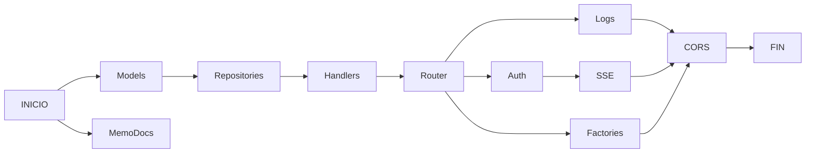
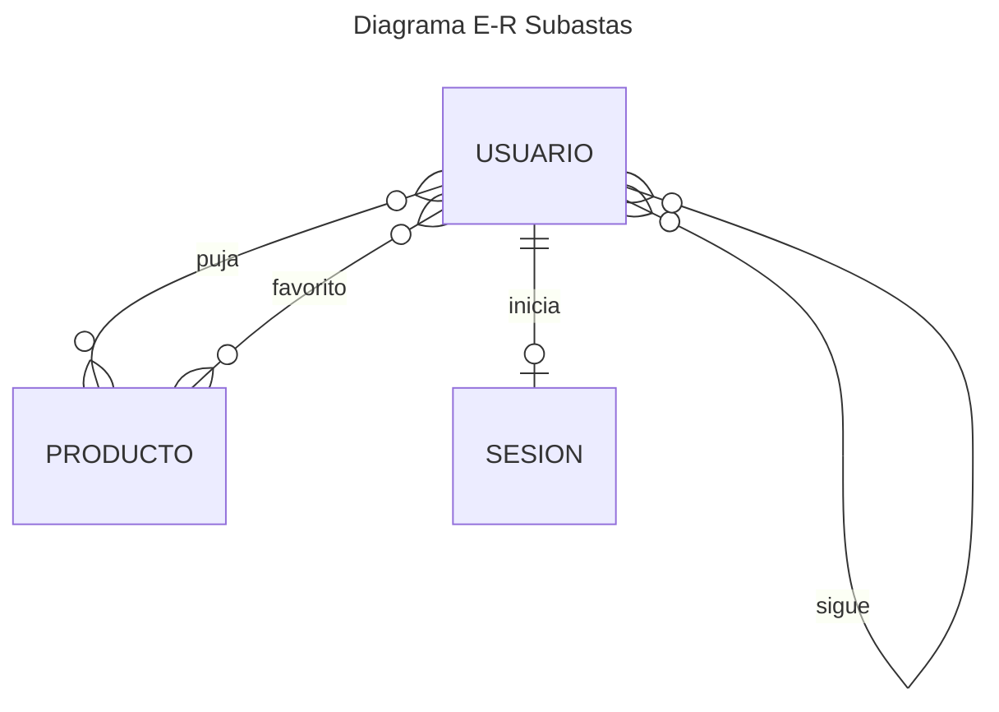
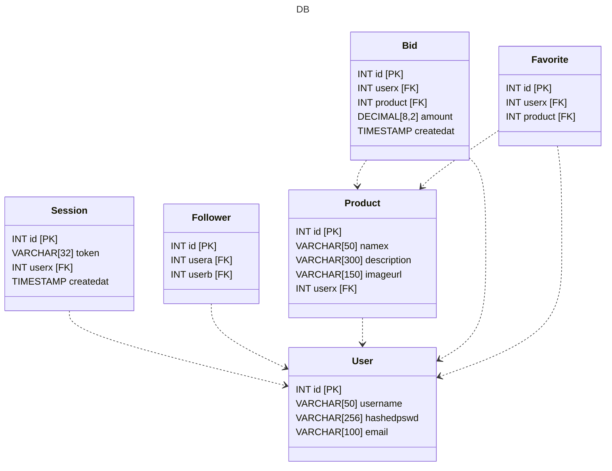

## Indice

1. Descripción del proyecto y ámbito de implantación
2. Temporalización del proyecto y fases de desarrollo
3. Recursos de hardware y software
4. Arquitectura de software y sistemas
5. Descripción de datos


## Descripción del proyecto y ámbito de implantación
El proyecto consiste en un API REST en Go para una web de subastas online. Los usuarios pueden registrarse, subastar 
sus productos y comprar los de otros. La REST API tiene alguna *feature* más, como permitir seguir/dejar de seguir a 
usuarios que resulten vendedores interesantes y marcar/desmarcar como favoritos productos apetecibles, estén o no en 
subasta. Estas *features* se implementan por cuestiones de completitud y cosmética.

La idea principal es poder simular una subasta en tiempo real: el servidor notifica de forma concurrente a todos los 
usuarios pujando por un producto dado a través de un SSE (Server Sent Event). La conexión se mantiene viva y el servidor
envía *updates* en un *event-stream* constante.

La base de datos PostgreSQL se aloja en un container Docker y aloja las tablas de base de datos que son el sustrato de 
la REST API.

## Temporalización del proyecto y fases de desarrollo

Las fases de desarrollo del proyecto se pueden ilustrar en un diagrama.
 + Memoria & Docs
 + Modelos
 + Repositorios
 + Handlers
 + Router
 + Logging
 + Autenticación
 + Server Sent Event
 + Factories
 + Cors headers



```mermaid
gantt
    title Fases de Desarrollo
    dateFormat YYYY-MM-DD
    section Backend
        Models           :a1, 2014-01-01, 30d
        MemoDocs         :a2, 21d
        
   

```

## Recursos de hardware y software

### Requisitos de Hardware
Los requisitos mínimos de hardware no son mayores de lo que se espera de un ordenador convencional moderno.
Algunos de ellos son:

+ Arquitectura de 64-bit
+ 4 o más GB de RAM
+ 30 GB de espacio libre en el disco
+ Un procesador que procese

El espacio de disco necesario será como mínimo el ocupado por los programas necesarios para alojar el software requerido, 
ya que la memoria ocupada por el proyecto en sí no es muy grande.

### Requisitos de Software

Los requisitos de software se resumen en los siguientes:

+ Go SDK
+ Docker (yo utilizo Docker Desktop)
+ PostgreSQL (en un container de Docker)
+ Node.js v.20 (para probar el frontend)
+ Postman

El sdk de Go es necesario para poder compilar y correr el servidor. Yo he utilizado una imagen de Postgres en un 
contenedor Docker para establecer una conexión con base de datos, pero no es *estrictamente* necesaria, con tal de que
la conexión se pueda efectuar correctamente.

Finalmente, y aunque no lo considero parte central del proyecto, he preparado también un frontal (a estas alturas no 
plenamente funcional) para probar los endpoints de la REST API. 

## Arquitectura de software y sistemas

Diagrama Entidad-Relación

Diagrama de la Estructura de Base de Datos


Endpoints

Además de las posibles respuestas listadas, todos los endpoints pueden arrojar un error 500, en el peor de los casos,
así como un error 405 de método no permitido.

| Concepto<br/>relacionado | Método | URL                               |   Headers   | Body | Errores                                                 |
|--------------------------|--------|-----------------------------------|:-----------:|:----:|---------------------------------------------------------|
| User                     | POST   | /user/new                         |             | JSON | 201<br/>400<br/>409 conflict email                      |
| User                     | POST   | /user/login                       |             | JSON | 201<br/>400<br/>409 already logged in                   |
| User                     | DELETE | /user/logout                      | "sessionid" |  -   | 200<br/>401                                             |
| Product                  | GET    | /products/{id}                    |             |  -   | 200<br/>404                                             |
| Product                  | GET    | /products?user=X&limit=Y&offset=Z |             |  -   | 200<br/>404                                             |
| Product                  | POST   | /products/new                     | "sessionid" | JSON | 201<br/>400                                             |
| Product                  | DELETE | /products/{id}                    | "sessionid" |  -   | 200<br/>404 no such product<br/>401 only owner can sell |
| Bid                      | POST   | /bids?product=X&amount=Y          | "sessionid" |  -   | 201<br/>404                                             |
| Bid                      | DELETE | /bids/{id}                        | "sessionid" |  -   | 200<br/>400<br/>401                                     |
| Follower                 | GET    | /followers/follow                 | "sessionid" |  -   | 200<br/>404                                             |
| Follower                 | POST   | /followers/follow/{id}            | "sessionid" |  -   | 201<br/>404<br/>409 already followed                    |
| Follower                 | DELETE | /followers/follow/{id}            | "sessionid" |  -   | 200<br/>404                                             |
| Favorite                 | GET    | /favorites?limit=X&offset=Y       | "sessionid" |  -   | 200<br/>404                                             |
| Favorite                 | POST   | /favorites/{id}                   | "sessionid" |  -   | 201<br/>404<br/>409 already favorite                    |
| Favorite                 | DELETE | /favorites/{id}                   | "sessionid" |  -   | 200<br/>404                                             |
| Auction                  | GET    | /auctions/watch?product=          | "sessionid" |  -   | 200<br/>404                                             |
| Auction                  | POST   | /auctions?product=                | "sessionid" |  -   | 201<br/>404<br/>401 not your product to sell            |
| Auction                  | DELETE | /auctions?product=                | "sessionid" |  -   | 200<br/>404<br/>401 not your product to sell            |


### Estructura del Proyecto
El proyecto está estructurado en 4 capas: el *router*, los *handlers*, los repositorios y los modelos.

| Router                           | Handler              | Repository                                | Model                                 |
|----------------------------------|----------------------|-------------------------------------------|---------------------------------------|
| Asocia las URLs a sus *handlers* | Gestiona la petición | Conecta directamente con la Base de Datos | Structs & Métodos asociados al objeto |

#### Router
El *router* se encarga de asociar a cada URL su *handler* correspondiente. Se encarga de hacer *pattern-matching* con las 
URL de las peticiones y devuelve automáticamente `405` si el método HTTP no coincide con el especificado.

#### Handlers
Los *handlers* procesan la petición HTTP recuperando de la *request* los parámetros (*query* & *path*) que sean necesarios.
Los *handlers* llaman a los repositorios y presentan los datos obtenidos por ellos o devuelven los errores oportunos, según sea el caso.

#### Repositories
Los repositorios son los que conectan directamente con la base de datos. Devuelven los datos de las consultas, ejecutan 
actualizaciones y eliminaciones. 

Errores en el acceso a los datos se propagan a la capa de handlers y se categorizan 
mediante un enum `relatedError`, que implementa la interfaz error. Lo hago así para lidiar con los errores sólo en la capa 
de handlers. Allí, un método `errorDispatch()` escribe en el ResponseWriter un status code apropiado, dependiendo del tipo
de error.

También trato la autenticación en esta capa, porque sólo tiene relevancia indirecta para los handlers y su función consiste
básicamente en comprobar si determinado token de sesión se encuentra o no en la DB. Aquí están las funciones que generan 
una `sessionid` aleatoriamente, devuelven la id del usuario cuya sessionid se ha pasado y eliminan un token del registro de
sesiones (logout).

#### Models
Representan en el programa objetos que es necesario manipular programaticamente de alguna forma. En concreto, aquí están 
los formularios asociados al producto y al usuario y los structs que modelan su representación para el frontend. 

Además, en el *package* de models se encuentran los métodos que comprueban la limpieza y validez de los datos
que se introducen en dichos formularios.

## Descripción de datos

### Descripción del SSE
Las subastas ocurren en tiempo real y por tanto, y para mayor rapidez y sencillez, almaceno la información relevante 
en structs asociados. El tipo `Auction` representa una subasta y contiene información sobre el precio a batir la lista 
de usuarios que presencian la subasta (que modelo con un `AuctionObserver`) y la id del producto que se está 
efectivamente subastando.

```go
type Auction struct {
	ProdId         int                // Product id
	Max            float32            // Current price to beat
	Subs           map[int]int        // Maps the ids of the observers/subscribers to the auction with their index in the notification list
	NotList        []*AuctionObserver // Notification list for all current observers
	NotificationWG sync.WaitGroup
}
```

```go
type AuctionHandler struct {
	auth     repositories.AuthRepo
	prod     repositories.ProductRepo
	auctions map[int]*Auction
}
```
Los observadores de la subasta tienen asociado un canal (un channel en Go) para comunicar la información del último
precio a batir.
```go
type AuctionObserver struct {
	UserId  int
	index   int
	channel chan BidMessage
}
```
Los usuarios que se encuentren observando la subasta son notificados de forma concurrentea través de sus canales asociados.
Un WaitGroup sincroniza las gorrutinas que se encargan de la notificación. 
```go
func (obs *AuctionObserver) notify(bm *BidMessage, wg *sync.WaitGroup) {
	if obs == nil {
		return
	}
	wg.Add(1)

	obs.channel <- *bm // bm is not modified in the goroutine, as it is, so no risk of race conditions

	wg.Done()
}
func (obs *AuctionObserver) Listen(ctx context.Context, w io.Writer, flusher http.Flusher) {
	for {
		select {
		case bm := <-obs.channel:
			message, err := json.Marshal(bm)
			if err != nil {
				log.Println(err)
			}
			_, err = fmt.Fprintf(w, eventMessageFormat, "bid", string(message))
			if err != nil {
				log.Println(err)
			}
			flusher.Flush()

		case <-ctx.Done():
			return
		}
	}
}
```


### Parámetros opcionales

Los parámetros opcionales están organizados en un struct que empareja un valor "opcional" (quizás un nombre desafortunado, 
porque no es lo mismo que Optional en otros contextos) con una Query. Una Query por debajo es una string, pero que además
implementa optional.
```go
type valueWithQuery struct {
	value optional
	query Query
}
type optional interface {
doesItMakeSense() bool
}
```
La idea es que aunque la función `doesItMakeSense()` podría ser tan sencilla como `return x != nil`, de esta forma se 
puede ajustar más a un contexto más concreto: en general no tiene sentido hablar de 1.5 zapatos o de -4 cervezas. 

Tal y como está, en la capa de repositorios, los métodos que invocan consultas a base de datos, aceptan como input
tipos primitivos, como int o string, que no admiten valores nulos. Por esto paso deliberadamente valores sin sentido 
desde la capa superior (la de handlers) en el caso de que no existan. 