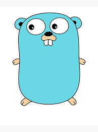
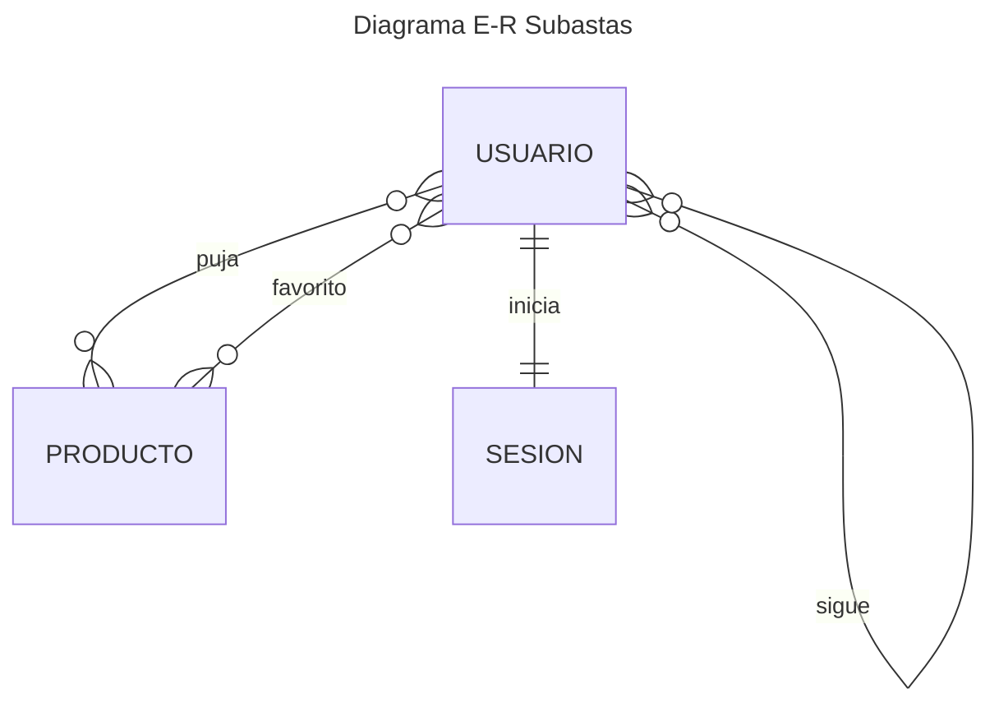
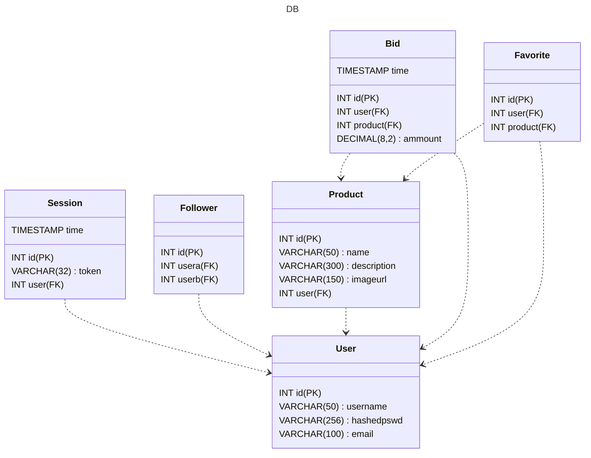
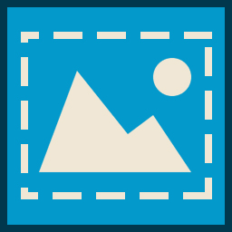

## Indice

1. Descripción del proyecto y ámbito de implantación
2. Temporalización del proyecto y fases de desarrollo
3. Recursos de hardware y software
4. Arquitectura de software y sistemas
5. Descripción de datos



## Descripción del proyecto y ámbito de implantación
El proyecto consiste en un API REST en Go para una web de subastas online. Los usuarios pueden registrarse, subastar sus productos y comprar los de otros.

La idea es poder simular una subasta en tiempo real: el servidor notifica de forma concurrente a todos los usuarios pujando por un producto dado a través de un SSE (Server Sent Event)

La base de datos PostgreSQL se aloja en un container Docker. 

## Temporalización del proyecto y fases de desarrollo


## Recursos de hardware y software

### Requisitos de Hardware
Ni idea.

Los máximos de los mínimos requisitos para el software requerido.

### Requisitos de Software

+ Docker
+ PostgreSQL (en un container de Docker)
+ Go SDK

## Arquitectura de software y sistemas

Diagrama Entidad-Relación

Diagrama de la Estructura de Base de Datos



### Estructura del Proyecto
El proyecto está estructurado en 4 capas: el *router*, los *handlers*, los repositorios y los modelos.

| Router                           | Handler              | Repository                                | Model                                 |
|----------------------------------|----------------------|-------------------------------------------|---------------------------------------|
| Asocia las URLs a sus *handlers* | Gestiona la petición | Conecta directamente con la Base de Datos | Structs & Métodos asociados al objeto |

#### Router
El *router* se encarga de asociar a cada URL su *handler* correspondiente

#### Handlers
Los *handlers* procesan la petición HTTP recuperando de la *request* los parámetros (*query* & *path*) que sean necesarios.
Los *handlers* llaman a los repositorios y presentan los datos obtenidos por ellos o devuelven los errores oportunos, según sea el caso.

#### Repositories
Los repositorios son los que conectan directamente con la base de datos. Devuelven los datos de las consultas, ejecutan actualizaciones y eliminaciones.

#### Models
Representan en el programa objetos asociados a las tablas de base de datos.


```javascript
// TODO Diagrama & Explicación de las tablas de la base de datos
```


```javascript
// TODO Detallar endpoints del API REST
```


## Descripción de datos


